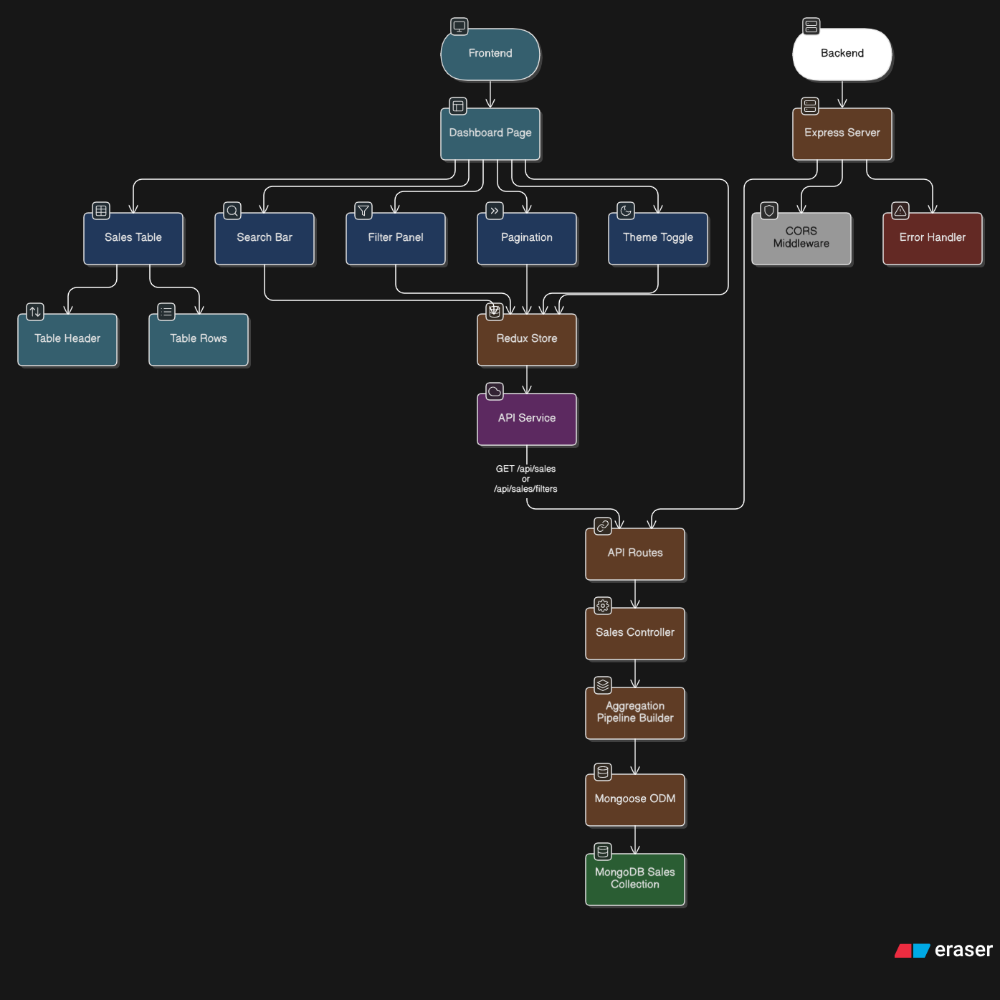

# Retail Sales Management System

A modern, full-stack application for analyzing retail sales data with advanced filtering, sorting, and search capabilities.

## Features
- **Dashboard**: View sales data in a responsive table.
- **Advanced Filtering**: Filter by Region, Gender, Age, Category, Payment Method, Tags, and Date Range.
- **Search**: Case-insensitive full-text search on Customer Name and Phone.
- **Sorting**: Sort by Date, Quantity, Amount, etc.
- **Pagination**: Efficient server-side pagination.
- **Dark Mode**: Toggle between Light and Dark themes.
- **Responsive Design**: Optimized for various screen sizes.

## Tech Stack
- **Frontend**: React, Vite, Tailwind CSS 4, Redux Toolkit
- **Backend**: Node.js, Express, MongoDB

## Prerequisites
- Node.js (v14+)
- MongoDB (Local or Atlas URI)

## Setup Instructions

### 1. Clone the Repository
```bash
git clone https://github.com/Mollygit001/truEstate.git
cd truEstate
```

### 2. Backend Setup
```bash
cd backend
npm install
```
- Create a `.env` file in `backend/` with:
```env
PORT=5000
MONGO_URI=mongodb://localhost:27017/retail_sales
```
- Start the server:
```bash
npm start
# or for dev
npm run dev
```

### 3. Frontend Setup
```bash
cd frontend
npm install
npm run dev
```
- Open `http://localhost:5173` in your browser.

## API Endpoints
- `GET /api/sales`: Get sales data (supports query params).
- `GET /api/sales/filters`: Get available filter options.

## Architecture Diagrams

```


```

## License
MIT
